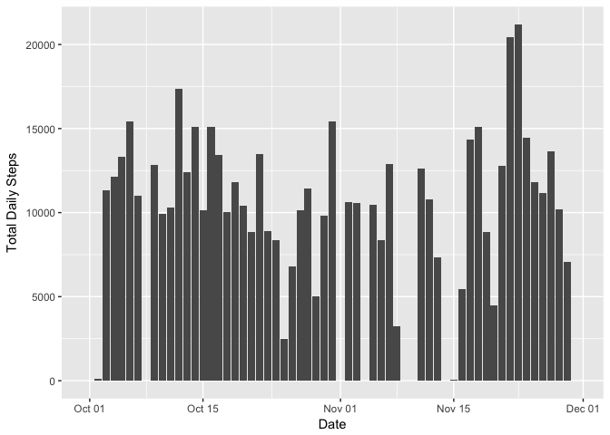
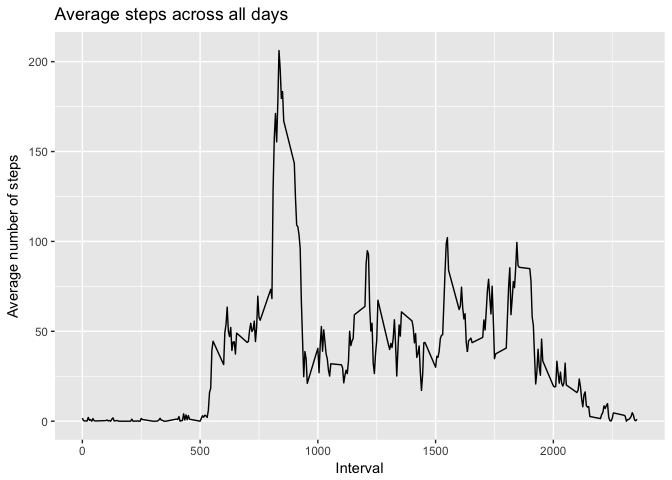
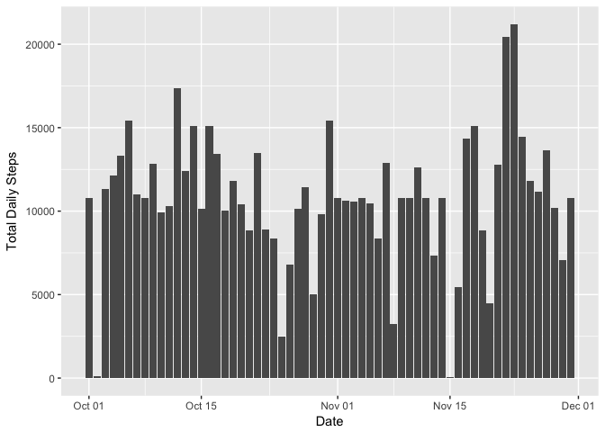
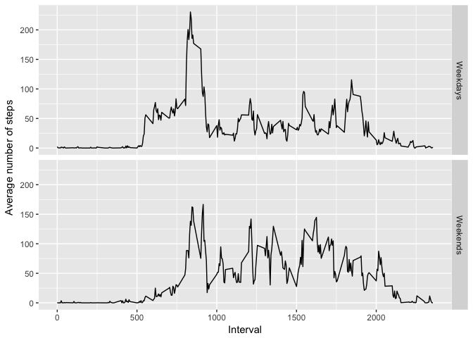

# Reproducible Research: Peer Assessment 1


## Loading and preprocessing the data
As long as the activity.zip file containing the dataset for this project is in your working directory, the R code below would load the data and change the date format from character to date format. The data set is called "Activity_Data".


```r
## Load the data from the git repository in working directory
File <- unzip("activity.zip")
Activity_Data <- read.csv("activity.csv", header = TRUE, sep = ",",na.strings = "NA" )
## Transform the date to date format
Activity_Data$date <- as.Date(as.character(Activity_Data$date, "%Y%m%d"))
```


## What is mean total number of steps taken per day?

The figure below is a histogram of the total number of steps taken each day over the months of October and November, 2012. Missing values in the dataset are ignored.


```r
library(ggplot2)

## Calculate the total number of steps taken per day
## and create dataframe of the values. Ignore missing values
total_daily_steps <- with(Activity_Data, tapply(steps, date, sum, na.rm = TRUE))
Total_Steps <- data.frame(date = unique(Activity_Data$date), total.daily.steps = total_daily_steps)

g <- ggplot(Total_Steps, aes(date, total.daily.steps))
g + geom_histogram(stat = "identity") + labs(x = "Date", y = "Total Daily Steps")
```

```
## Warning: Ignoring unknown parameters: binwidth, bins, pad
```

<!-- -->


```r
## Calculate the mean and median of the total no. of steps taken per day
Mean_total_daily_steps <- mean(Total_Steps[,2], na.rm = TRUE)
Mean_total_daily_steps <- round(Mean_total_daily_steps)
Median_total_daily_steps <- median(Total_Steps[,2], na.rm = TRUE)
```


The mean and median of the total number of steps taken each day are 9354, and 10395 respectively. 


## What is the average daily activity pattern?

The time series plot below describes the average daily activity pattern. The plot shows the average number of steps, averaged across all days for each 5-minute interval recorded. The missing values are ignored.


```r
## Calculate the average no. of steps across all days, ignore missing values.
average_steps <- with(Activity_Data, tapply(steps, interval, mean, na.rm = TRUE))
Ave_Steps_per_Interval <- data.frame(interval = unique(Activity_Data$interval), Ave.steps = average_steps)

## Make time series plot of the average no. of steps across all days
## Ignore missing values.
g <- ggplot(Ave_Steps_per_Interval, aes(interval, Ave.steps))
g + geom_line() + labs(title = "Average steps across all days", x = "Interval", 
                       y = "Average number of steps")
```

<!-- -->


```r
## Report the 5-minute interval with the maximum no. of steps averaged across all days
## Ignore missing values.
Max.Steps.Interval = Ave_Steps_per_Interval[which.max(Ave_Steps_per_Interval$Ave.steps),][,1]
```

As shown on the time series plot above, the time interval of 835 has the maximum average number of steps. 


## Imputing missing values

In the activity dataset, there are a number of days/intervals where there are missing values.


```r
## Calculate and report the total no. of rows with NAs
no.missing <- sum(is.na(Activity_Data$steps))
```

There are 2304 rows with missing values in the activity dataset.

In order to fill in the missing values, I decided to use the mean of the corresponding 5-minute interval. This creates a new data set called "Activity_Data_filled".


```r
## Fill missing values in dataset with the mean for that 5-minute 
## interval averaged across all days.
Activity_Data_filled <- Activity_Data

for (i in 1:nrow(Activity_Data_filled)){
    if (is.na(Activity_Data_filled[i,1])){Int = Activity_Data_filled[i,3]
    a <- subset(Ave_Steps_per_Interval, interval == Int)
    Activity_Data_filled[i,1] = a$Ave.steps[[1]]}
    else (Activity_Data_filled[i,1] = Activity_Data_filled[i,1])
}
```


The figure below is a histogram of the total number of steps taken each day over the months of October and November, 2012. The imputed values are used in this plot.


```r
## Calculate the total number of steps taken per day
## and create dataframe of the values. Using imputed data.
total_daily_steps2 <- with(Activity_Data_filled, tapply(steps, date, sum))
Total_Steps2 <- data.frame(date = unique(Activity_Data_filled$date), total.daily.steps = total_daily_steps2)

## Make histogram of the total number of steps taken each day
g <- ggplot(Total_Steps2, aes(date, total.daily.steps))
g + geom_histogram(stat = "identity") + labs(x = "Date", y = "Total Daily Steps")
```

```
## Warning: Ignoring unknown parameters: binwidth, bins, pad
```

<!-- -->


```r
## Calculate the mean and median of the total no. of steps taken per day
## Using imputed data.
Mean_total_daily_steps2 <- mean(Total_Steps2[,2], na.rm = TRUE)
Median_total_daily_steps2 <- median(Total_Steps2[,2], na.rm = TRUE)
```

Recalculating using the imputed data, the mean and median of the total number of steps taken each day are 1.0766189\times 10^{4}, and 1.0766189\times 10^{4} respectively. 

As shown in the dataset below, these values are slightly higher than the estimates made by ignoring the missing values.


```r
data.frame(Stats = c("Mean", "Median"), Ignore.missing = c(Mean_total_daily_steps, Median_total_daily_steps), Imputed.data = c(Mean_total_daily_steps2, Median_total_daily_steps2))
```

```
##    Stats Ignore.missing Imputed.data
## 1   Mean           9354     10766.19
## 2 Median          10395     10766.19
```


## Are there differences in activity patterns between weekdays and weekends?

To compare the difference in activity patterns between weekdays and weekends, I use a panel plot of a time series plot of the average number of steps for each 5-minute interval, averaged acrosse either weekdays, or weekends.


```r
## Create a new factor variable called days in the dataset
for (i in 1:nrow(Activity_Data_filled)){
    if (weekdays(Activity_Data_filled$date[i]) %in% c("Monday", "Tuesday", "Wednesday", "Thursday", "Friday"))
        Activity_Data_filled$days[i] <- "Weekday"
    else Activity_Data_filled$days[i] <- "Weekend"
}

Activity_Data_filled <- transform(Activity_Data_filled, days = factor(days))


## Subset the data based on weekdays and weekends
Weekdays <- subset(Activity_Data_filled, days == "Weekday")
Weekends <- subset(Activity_Data_filled, days == "Weekend")

## Calculate the average no. of steps for each 5-minute interval
Weekdays_mean <- with(Weekdays, tapply(steps, interval, mean))
Weekends_mean <- with(Weekends, tapply(steps, interval, mean))

## Create dataframes of the average no. of steps for each 5-minute interval
Weekdays_mean_data <- data.frame(interval = unique(Weekdays$interval), ave.steps = Weekdays_mean, days = "Weekdays")
Weekends_mean_data <- data.frame(interval = unique(Weekends$interval), ave.steps = Weekends_mean, days = "Weekends")

## Bind the dataframes 
Days_mean_data <- rbind(Weekdays_mean_data, Weekends_mean_data)

## Create a panel plot containing a time series plot of the average no. 
## of steps for each 5-minute interval averaged across weekdays and weekends
g <- ggplot(Days_mean_data, aes(interval, ave.steps))
g + geom_line() + facet_grid(days~.) + labs(x = "Interval", y = "Average number of steps")
```

<!-- -->

The figure above shows more activity between time interval of 1000 and 2000 over the weekends compared to the weekdays.
